# 社交行为聚集性分析:从进房、互相间IM私信的角度分析圈定社交人群

【业务需求】UGC内容违规用户水位分析和群体下钻需求

## 相关表和关键字段

**ttdw.dwd_tt_social_user_friend_accum_df(明细层_截止当天社交用户累计结伴用户天表_全量**

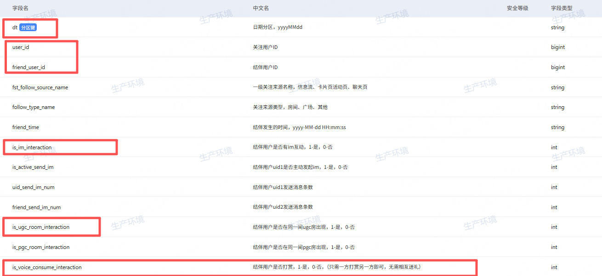

dt 日期分区 yyyyMMdd格式 string

user_id 关注用户ID bigint

friend_user_id  被user_id关注的用户ID bigint

is_im_interaction   结伴用户是否有im互动，1-是，0-否  int类型

is_ugc_room_interaction  结伴用户是否在同一间UGC房出现 1-是，0 否 int类型

is_voice_consume_interaction  结伴用户是否打赏 1-是 0-否  （只需一方打赏另一方即可，无需相互送礼)

**IM表：ttdw.dwd_tt_social_user_im_di (明细层_社交用户发消息明细天表_增量）**

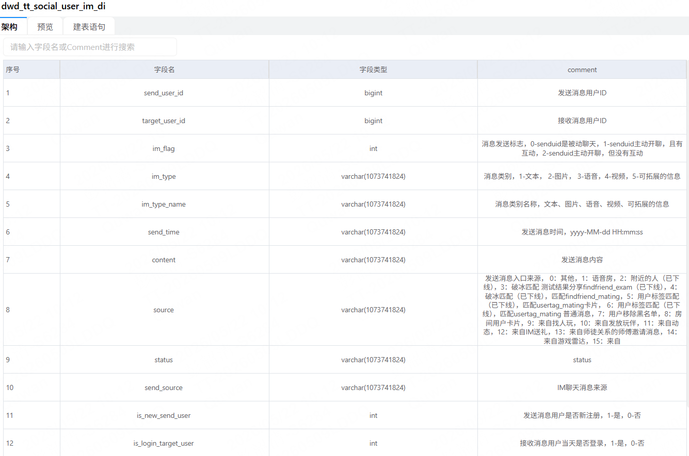

**进房表：ttdw.dwd_entering_room_base_di**

dwd_entering_room_base_di(明细层_用户房间停留时长底表_增量)

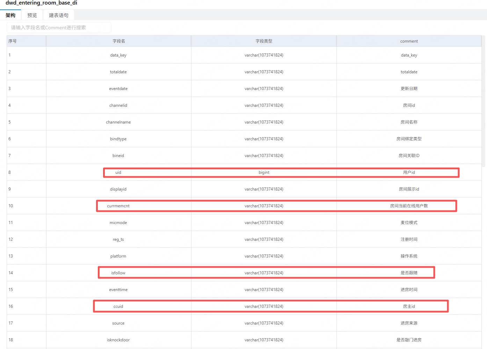

注意这里的totaldate 是2023-07-13 23:36:58这种，但依然是string类型

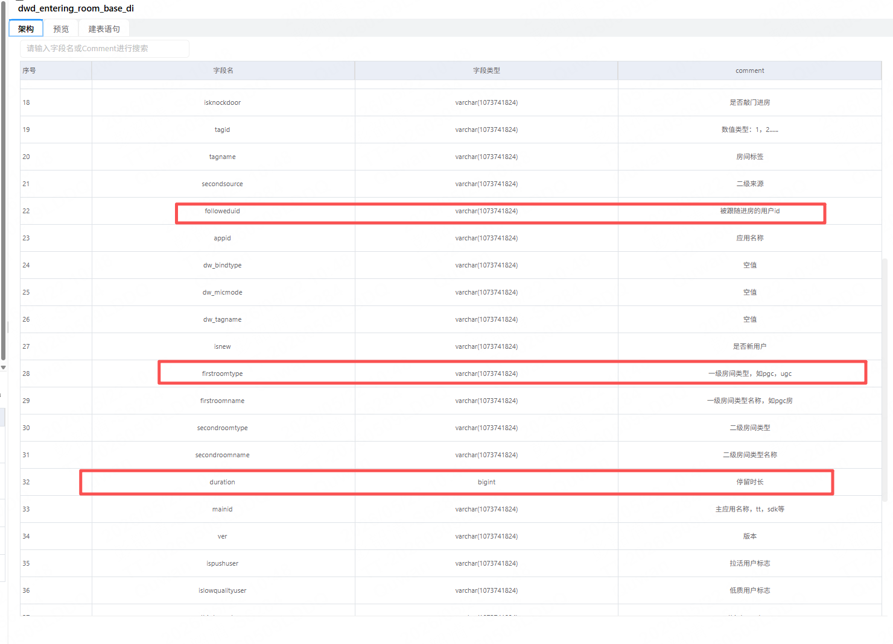

**同房（同个房间）：ttdw.dim_tt_room_together_user_di（这个表很大）**

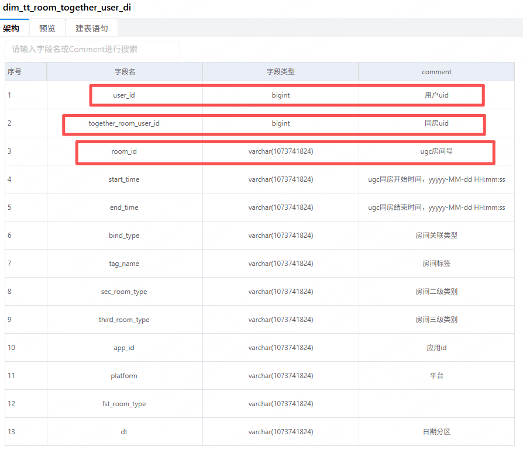

**关注表：ttdw.dwd_tt_social_user_follow_di**

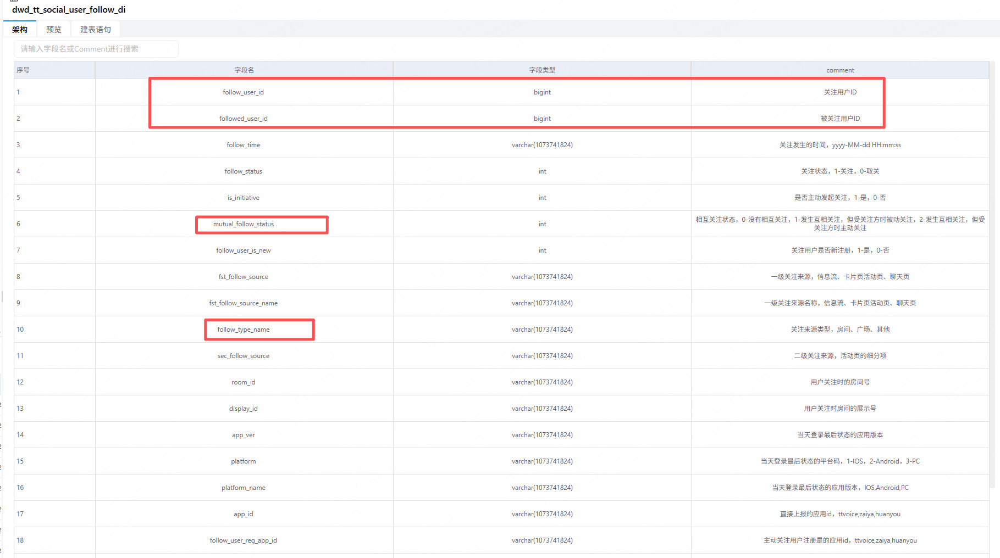

**处罚表：tshielddw.**

**，限制source_type='举报核实处罚' and obj_type_id='1'----用户  明细层_风控域_处罚记录**

**关联账号（身份证、手机、设备关联）：**ttdw.ads_tt_risk_user_related_user_detail_di**(汇总层_风控域_关联用户信息表)**

预览

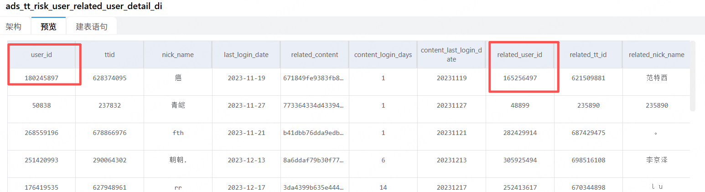

有label_name   label_level_key字段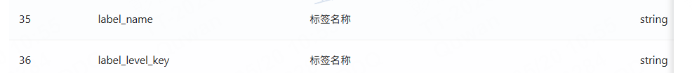

**登录：ttdw.dwd_tt_user_login_base_di    user_id**


**进房：ttdw.dwd_entering_room_base_di   uid是用户id**

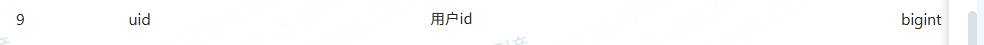

**上麦：ttdw.dwd_tt_room_user_up_mic_di  明细层_用户房间上麦天表_增量  user_id字段上麦用户id**

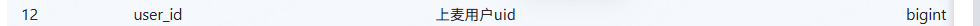

**注册时间取用户信息宽表：ttdw.dim_tt_user_base_info_df**

**关联账号（身份证、手机、设备关联）：ads_tt_risk_user_related_user_detail_di(汇总层_风控域_关联用户信息表)**

```sql
select distinct user_id,
                                                        dt,
                                                        related_user_id----关联账号
                                        from ttdw.ads_tt_risk_user_related_user_detail_di
                                        where dt >= '${_day}'
                                          and dt <= '${_day}'
                                          and relation_mode in ('id_card', 'phone','device','ip')

```

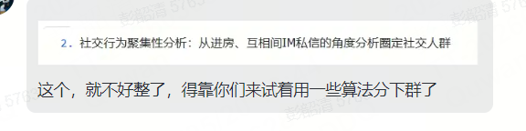

**这个需求你先看看吧，除了社交行为聚集这块**

**2个表，第一个是水位，第二个是分人群的关联数据**

关联方式：身份证/设备/手机码任一相同，就统计一次违规次数

**应该不需要这个字段。**[https://dataplus.skyengine.com.cn/#/data-development/task/detail-read?taskId=502203&amp;tenantId=55&amp;tabkey=3&amp;isDetail=true](https://dataplus.skyengine.com.cn/#/data-development/task/detail-read?taskId=502203&tenantId=55&tabkey=3&isDetail=true) 我这个脚本是以前的需求，和你现在的需求有点像，你可以看看

## 会话记录

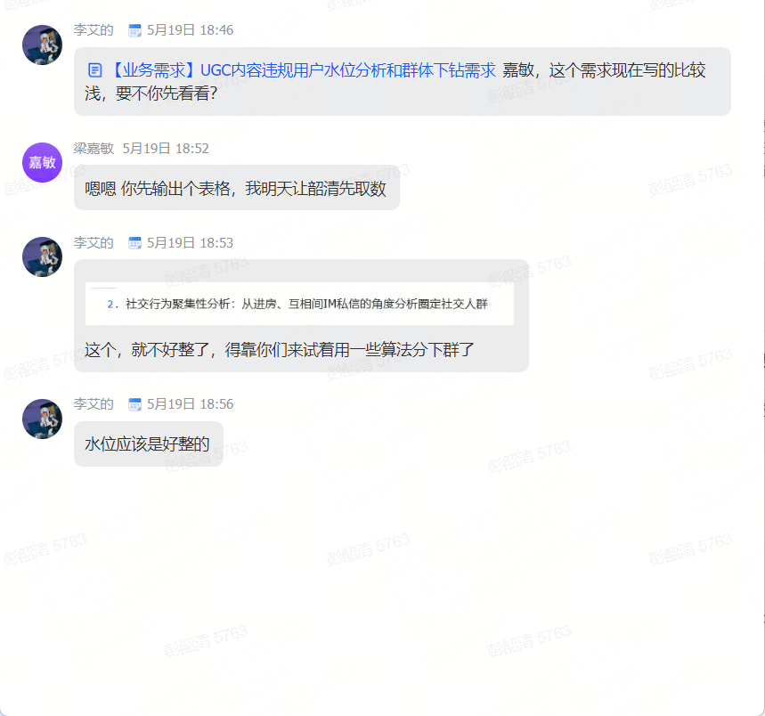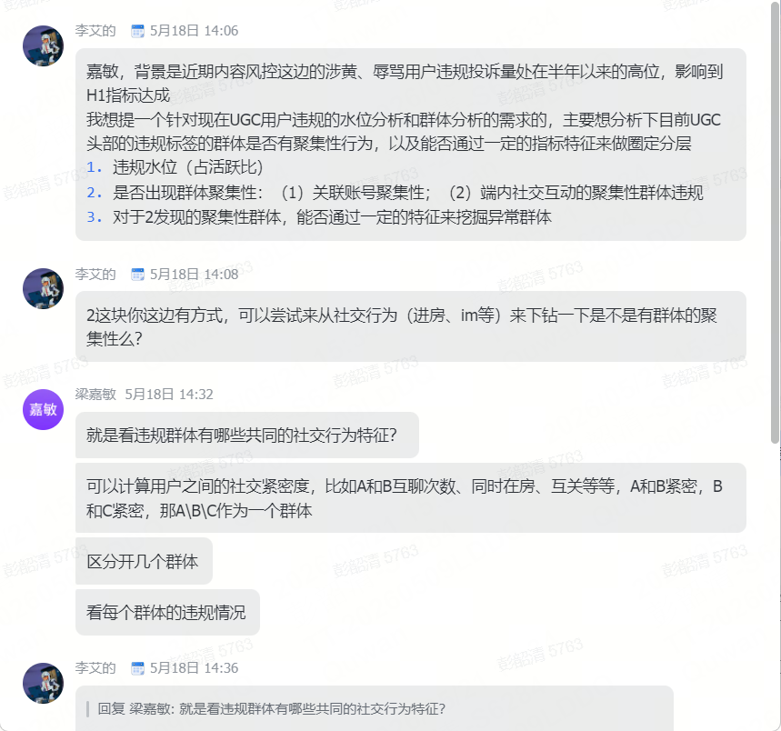

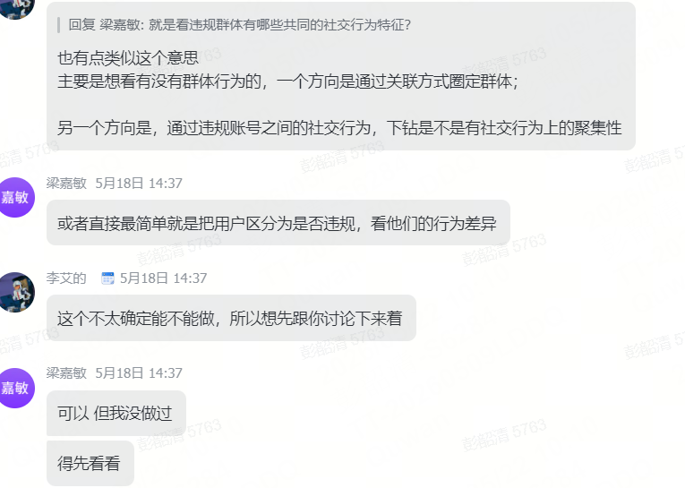

现在我有一个新的需求：针对违规人群输出包含第三张图片表格要求的9个字段的表格，其中ttid就是tshielddw.dwd_kafka_tshield_biz_sanction_record_hi的ttid字段，uid对应其user_id字段（之前提到过），实锤违规日期就是其dt,注册时间对应ttdw.dim_tt_user_base_info_df的reg_time字段，违规人群分类的涉黄人群指 label_name字段值是：情色内容、涉黄行为、付费性挑逗表演、违背社会公德（如约炮等）中的一个，辱骂人群指label_name字段值是：辱骂（严重）、群体歧视 这两个中的一个，最后的4个近30天关联账号违规次数利用

## 如何分析

社交行为聚集性分析：**从进房、互相间IM私信的角度分析圈定社交人群**：如果一批违规用户经常进同一批房间、互相私信、或者围绕某些房间/用户形成高频互动，那么他们可能不是孤立违规，而是存在社交圈层或**群体性聚集**。

### 如何区分用户圈层？

不是所有违规用户都一样，有些是单点作恶，有些是账号团伙，有些是社交圈子里的集体违规。

粗略分成几类

* 一 ：孤立违规用户

这类用户没有明显关联账号，也没有明显和其他违规用户发生社交聚集。特征可能是：

无关联账号违规？
无共同进房聚集
无违规用户之间IM互动

* 二：账号关联型违规用户

这类用户和其他违规账号存在身份证、手机号、设备关联。特征是：

关联账号涉黄/辱骂违规账号数 > 0
或
关联账号涉黄/辱骂违规次数 > 0

同一人、多账号、设备批量号，适合做账号维度的扩散治理。

* 三：房间聚集型违规用户

这类用户之间未必有身份证、手机号、设备关联，但他们可能经常出现在同一批房间。例如：

用户 A、B、C、D 都被举报涉黄
他们在近 7 天内都进入过房间 R1、R2
并且这些房间中涉黄违规用户占比很高，这说明违规可能围绕房间生态发生。

这种可以下钻到：

```
高风险房间
高风险主播/房主
高风险进房链路
涉黄用户聚集房间
辱骂用户聚集房间
```

* 四：IM互动聚集型违规用户

这类用户之间通过私信形成关系。

A 给 B 发过 IM
B 给 C 发过 IM
C 给 A 发过 IM
A、B、C 都是涉黄违规用户

这说明他们之间存在社交互动关系，不只是共同出现在平台上。

这种更接近“社交圈层”或“关系网络”。

* 五：混合聚集型违规用户

这类用户既有账号硬关联，又有社交行为聚集。例如：

同设备关联 + 共同进房 + IM互聊，或者其他组合

这种风险最高，可能是团伙、工作室、引流链路或组织化违规。

### 如何产出

社交行为群体聚集分类”设计成一个分类字段，比如

孤立违规
账号关联聚集
进房聚集
IM聚集
进房+IM聚集
账号关联+社交聚集
高风险混合聚集

或者更细

无明显聚集
仅关联账号聚集
仅共同进房聚集
仅IM互动聚集
共同进房+IM互动聚集
关联账号+共同进房
关联账号+IM互动
关联账号+共同进房+IM互动  即C31 C32 C33

大致方向：把违规用户按照其与其他违规用户之间的关系类型进行分层，判断其属于孤立违规、账号关联型违规、房间聚集型违规、IM互动型违规，还是多种关系叠加的高风险群体。

### 后续怎么做呢？预设策略反推上游产出

| 圈层类型     | 可能含义               | 治理方向                         |
| ------------ | ---------------------- | -------------------------------- |
| 孤立违规     | 个体偶发违规           | 单账号处罚、内容策略             |
| 账号关联聚集 | 多账号/设备/身份关联   | 关联账号扩散、设备封禁           |
| 进房聚集     | 某些房间吸引违规用户   | 房间治理、房主治理、进房链路治理 |
| IM聚集       | 违规用户之间有私信关系 | 社交链路风控、私信限制           |
| 混合聚集     | 疑似组织化违规         | 团伙识别、批量治理               |

### 根据最终目的优化

最终目的：上半年风控业务目标为压降用户&房间投诉下降30%，目前涉黄和辱骂处于上半年的历史高位


核心问题：哪些当前还没有被处罚/没有被举报实锤的用户，和近期违规用户之间存在较强社交关系？这些用户是否值得提前送审？

举报率太高了，正常是举报之后才送审，评定是违规的（先过一遍正则，然后剩下的人工？） 然后想制定一个策略让他在没有被举报之前就送过去审查？这样就可以降低举报率吧。

`uid` 不再一定是违规用户，而是 **待评估的大盘用户** 。`related_uid` 才是近期违规用户。

uid：大盘候选用户，可以是当天活跃用户、进房用户、上麦用户、IM活跃用户
related_uid：近30天违规用户

`某个大盘用户 uid，在近30天内是否和近期违规用户 related_uid 发生过同房、IM、玩伴、硬关联等关系。`

A 是当天活跃用户，还没有被处罚
B 是近30天涉黄违规用户
A 和 B 近30天多次同房、双向IM、是玩伴，甚至有设备关联

这种 A 就是潜在高风险用户，可以进入送审池

#### 再做两张表：大盘用户-违规用户关系边表

粒度：uid + violate_uid

字段

uid                         大盘候选用户
violate_uid                 近30天违规用户

together_room_cnt_30d       近30天和违规用户共同出现的UGC房间数
together_cnt_30d            近30天和违规用户UGC同房次数

im_send_to_violate_cnt_30d  近30天主动发IM给违规用户次数
im_recv_from_violate_cnt_30d近30天收到违规用户IM次数
im_total_with_violate_cnt_30d
is_bi_im_with_violate_30d

is_friend_with_violate      是否和违规用户是玩伴
is_friend_im_interaction    玩伴中是否有IM互动
is_friend_ugc_room_interaction

is_device_related           是否设备关联
is_phone_related            是否手机号关联
is_idcard_related           是否身份证关联

#### 第二张：大盘用户风险特征汇总表

先做边表，再做汇总表

粒度：uid

字段

```
uid

related_violate_uid_cnt_30d             近30天关联到的违规用户数
related_yellow_uid_cnt_30d              近30天关联到的涉黄违规用户数
related_abuse_uid_cnt_30d               近30天关联到的辱骂违规用户数

together_violate_uid_cnt_30d            近30天同房违规用户数
together_violate_room_cnt_30d           近30天共同出现的违规UGC房间数
together_violate_cnt_30d                近30天和违规用户同房次数

im_violate_uid_cnt_30d                  近30天IM互动违规用户数
im_bi_violate_uid_cnt_30d               近30天双向IM违规用户数
im_violate_msg_cnt_30d                  近30天和违规用户IM总条数

friend_violate_uid_cnt                  玩伴中违规用户数

hard_related_violate_uid_cnt            设备/手机/身份证硬关联违规用户数

risk_relation_source_cnt                命中的关系来源数
risk_score                              风险分
send_review_flag                        是否建议送审
```

用户池选定当天


# 基本情况

总违规数144945，其中近7天内注册的违规账号6786，占比4.7%不高，会存在批量注册，短周期作恶风险吗？

## 社交行为聚集特征表中间表

ads_ugc_violate_user_social_cluster_feature_di  应用层_UGC_违规用户社交聚集特征表_日

核心粒度 dt + uid  **一行表示某个违规用户在违规日前一段时间内的社交聚集特征** 。

表的目的：

```
这个违规用户是否和其他违规用户存在社交关系？
是通过进房聚集，还是IM聚集，还是关注/结伴关系聚集？
是否存在明显圈层？
圈层强度如何？
```

这张表先不要直接产出“强/弱/聚集类型”，而是保留原始关系证据。看后续需不需要用聚类来做，就算后面不需要，也可以重新后续来丰富

建议逻辑是：

先建 **边表** ，把不同社交关系统一起来：

违规用户A - 关联用户B - 关系类型 - 关系次数 - 是否违规关联用户

再基于边表聚合成 **用户宽表** ：

```sql
每个违规用户关联人数
关联违规人数
关联A/B/C违规人数
同房违规人数
IM违规人数
关注违规人数
违规关系占比
社交聚集分类
```

## 关于效果验证

注意时间窗口，确定时间线，比如今天被确认违规的用户，取他们昨天/前天的数据进行预测，看能够精准命中多少违规用户


# 取数参考脚本

ttdw.ads_tt_risk_user_related_user_detail_di表，计算方式参考以下脚本：set catalog no_cache_hive;

insert overwrite hive.ttanalyse.tmp_analyse_tt_risk_content_ecology_uid_crowd_type_detail_di partition(dt='${_day}')

----活跃用户

with  dau_detail as (SELECT distinct to_date(data_date)      t,user_id

    FROM ttdw.dwd_tt_user_login_base_di

    where dt >= '${_day}'

    and dt <= '${_day}'

    -- 取目标日期当周和上一周完整周数据

    --AND app_id IN ('huanyou', 'ttvoice')

    ),

----签约信息

    anchor_detail as (select uid, case

    when peipei = 0 and anchor = 1 then '语音主播'

    when peipei = 1 and anchor = 0 then '娱乐厅签约成员'

    when peipei = 1 and anchor = 1 then '语音主播&签约成员'

    end as user_type

    from (select uid, max (if (identity_type = '0', 1, 0)) as peipei, max (if (identity_type = '1', 1, 0)) as anchor, max (if (identity_type = '2', 1, 0)) as dianjing

    from ttanalyse.tmp_current_anchor_identity

    where totalDate = '${_day, yyyy-MM-dd}'            --最新一天

    and current_status = '1'

    and identity_type in ('0', '1')--0-娱乐厅陪陪，1-语音直播主播，2-电竞指导，3-平台达人

--and uid in (${uidlist})

    group by uid) a),

----涉黄

sanction_detail as (select dt, user_id,to_date(create_time)t

    from tshielddw.dwd_kafka_tshield_biz_sanction_record_hi

    where dt >= '${_day-29}'

    and dt <= '${_day}'

    AND label_level_key in ('A','B')

    AND label_name in ('情色内容','涉黄行为')

    --and REGEXP(violation_reason, '情色内容|涉黄行为')

    and obj_type_id = '1'

    and source_type in ('举报核实处罚','音频一巡处罚','音频流机审自动处罚')

    ),

----辱骂

sanction_detail2 as (select dt, user_id,to_date(create_time)t

    from tshielddw.dwd_kafka_tshield_biz_sanction_record_hi

    where dt >= '${_day-29}'

    and dt <= '${_day}'

    AND label_level_key in ('C')

    AND label_name in ('辱骂（严重）')

    --and REGEXP(violation_reason, '情色内容|涉黄行为')

    and obj_type_id = '1'

    and source_type in ('举报核实处罚','音频一巡处罚','音频流机审自动处罚')

    ),

----关联账号

related_detail as (

select user_id,

    dt,

    related_user_id----关联账号

    from ttdw.ads_tt_risk_user_related_user_detail_di

    where dt >= '${_day}'

    and dt <= '${_day}'

    and relation_mode in ('id_card', 'phone','device')),

-- 人群A：PGC从业者主播/签约用户

crowd_a AS (

    SELECT DISTINCT

    a.user_id,

    'A-PGC从业者' AS crowd_type,

    b.user_type AS detail_type

    FROM dau_detail a

    INNER JOIN anchor_detail b

    ON a.user_id = b.uid

),

-- 人群C：频繁涉黄违规用户（近30天违规>=3天）

crowd_c AS (

    SELECT

    user_id,

    'C-频繁涉黄违规用户' AS crowd_type,

    concat('违规天数：',CAST(COUNT(DISTINCT t) AS STRING)) AS detail_type

    FROM sanction_detail

    GROUP BY user_id

    HAVING COUNT(DISTINCT t) >= 3

),

-- 人群E：频繁辱骂违规用户（近30天违规>=3天）

crowd_e AS (

    SELECT

    user_id,

    'E-频繁辱骂违规用户' AS crowd_type,

    concat('违规天数：',CAST(COUNT(DISTINCT t) AS STRING)) AS detail_type

    FROM sanction_detail2

    GROUP BY user_id

    HAVING COUNT(DISTINCT t) >= 3

),

-- 人群B：PGC从业者关联账号（无签约身份）

crowd_b AS (

    SELECT DISTINCT

    r.related_user_id AS user_id,

    'B-PGC从业者关联账号' AS crowd_type,

    CONCAT('关联自:', a.user_id) AS detail_type

    FROM crowd_a a

    INNER JOIN related_detail r

    ON a.user_id = r.user_id

    LEFT JOIN anchor_detail b

    ON r.related_user_id = b.uid

    WHERE b.uid IS NULL  -- 排除有签约身份的

),

-- 人群D：频繁涉黄违规用户关联账号

crowd_d AS (

    SELECT DISTINCT

    r.related_user_id AS user_id,

    'D-频繁涉黄违规关联账号' AS crowd_type,

    CONCAT('关联自:', c.user_id) AS detail_type

    FROM crowd_c c

    INNER JOIN related_detail r

    ON c.user_id = r.user_id

),

-- 人群F：频繁辱骂违规用户关联账号

crowd_f AS (

    SELECT DISTINCT

    r.related_user_id AS user_id,

    'F-频繁辱骂违规关联账号' AS crowd_type,

    CONCAT('关联自:', e.user_id) AS detail_type

    FROM crowd_e e

    INNER JOIN related_detail r

    ON e.user_id = r.user_id

)

-- 最终输出：合并所有人群（用户可能属于多个人群）

SELECT

    '${_day,yyyy-MM-dd}' AS t,

    t.user_id,---用户ID,

    crowd_type,---所属人群类型,

    detail_type---人群详情

FROM (

    SELECT user_id, crowd_type, detail_type FROM crowd_a

    UNION ALL

    SELECT user_id, crowd_type, detail_type FROM crowd_b

    UNION ALL

    SELECT user_id, crowd_type, detail_type FROM crowd_c

    UNION ALL

    SELECT user_id, crowd_type, detail_type FROM crowd_d

    UNION ALL

    SELECT user_id, crowd_type, detail_type FROM crowd_e

    UNION ALL

    SELECT user_id, crowd_type, detail_type FROM crowd_f

) t join dau_detail a on t.user_id=a.user_id

ORDER BY t.user_id, crowd_type

;					脚本中
