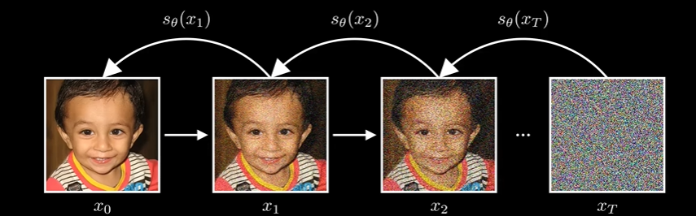
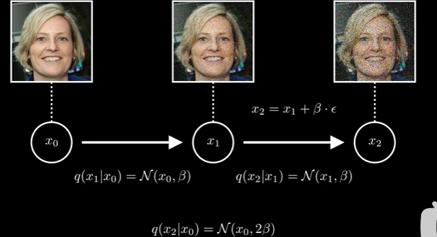

# diffusion model

不存在能够描述图像数据分布的单一表达式。但是即使没有公式，我们仍然希望能够直接生成图像，相当于从其潜在分布中抽取新样本，所以关键挑战就是如何生成新的样本，扩散模型就是来解决这个问题的，用一个看似不相关的过程来解决这个问题：从图像中去除高斯噪声

这个生成模型的基本逻辑是：把真实数据逐步加噪声，直到变成接近随机噪声（方便反向操作）；再训练模型学会反向去噪，从随机噪声一步步还原出像真实数据一样的新样本。

## steps

首先，我们通过逐步添加高斯噪声来破坏图像，每一步都只添加少量噪声，从而慢慢抹去图像的结构，一步一步知道变成纯粹的噪声

所以关键的思想就是训练一个模型，让它学会缓慢的逆转这些步骤，去除噪声，最终，**如果模型有效**，它应该可以从随机噪声开始，并且一步步将其细化成有意义的图像

DDPM中如何阐述这个过程？

从一张图片开始，我们称为x0，加噪过程的起点，不包含任何噪声，为了生成下一张图像X1, 使用条件分布q(x1|x0)     ,  $x_1=x_0 + \beta \cdot \epsilon$

$\epsilon$ 是噪声 标准正态分布  q(x1|x0) = N ( $x_0,\beta^2$) ,即$x_1$就是一个以x0为中心，方差为$\beta^2$的高斯分布, 然后迭代这个过程，

然后直接跳到最后一步，做t步这个过程  $x_t=x_0+t\beta\cdot\epsilon$

所以就可以描述任何给定步骤中发生的情况，so, at time step t，已经x0的情况下，$x_t$服从高斯分布 $N(X_0,t^2\beta^2)$

但是这个过程存在一个问题，我们想要的是一个能够将数据逐步转换的流程，使其变为标准正态分布，但是这里均值固定，方差不停地增大， 肯定无法收敛到正态分布，所以需要构建一个能够真正收敛到正态分布的diffusion process

# 为什么我们想要的是一个能够将数据逐步转换的流程，使其变为标准正态分布？

“变成标准正态分布”不是最终目的，而是为了让“生成新数据”有一个可控、可采样的起点。

这里的核心不是说“图像数据本身应该变成标准正态分布”，而是：**我们需要把复杂的数据分布，逐步变成一个我们非常熟悉、非常容易采样的分布。也就是标准正态分布**

为什么$N(X_0,t^2\beta^2)$作为**生成模型的理想起点** ??这个分布本身当然可以采样。

问题是，训练时有 x0，生成时没有 x0,训练时，我们从真实数据里拿到一张图：**x**0,然后加噪声：$x_t=x_0+ \sigma_t\epsilon$ 这个当然没问题，因为训练时 x0 是已知的

但生成时，**目标**正是要生成一个新的 $x_0$ ,而标准正态分布的好处不依赖任何真实图像，其实任何已知分布都可以，总而言之就是寻找一个确定的过程让图像变成我们知道的分布，然后反推回去，就可以生成很多相似的数据了
