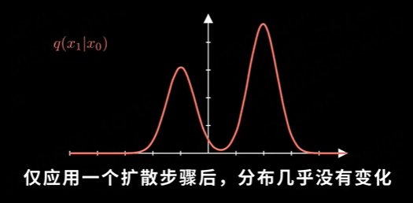
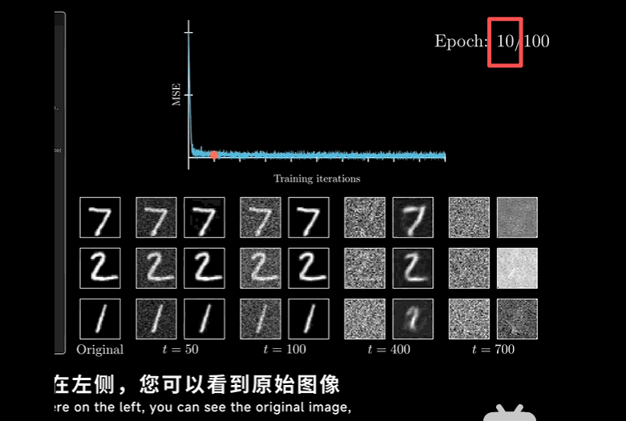

# diffusion model

不存在能够描述图像数据分布的单一表达式。但是即使没有公式，我们仍然希望能够直接生成图像，相当于从其潜在分布中抽取新样本，所以关键挑战就是如何生成新的样本，扩散模型就是来解决这个问题的，用一个看似不相关的过程来解决这个问题：从图像中去除高斯噪声

这个生成模型的基本逻辑是：把真实数据逐步加噪声，直到变成接近随机噪声（方便反向操作）；再训练模型学会反向去噪，从随机噪声一步步还原出像真实数据一样的新样本。

## steps

首先，我们通过逐步添加高斯噪声来破坏图像，每一步都只添加少量噪声，从而慢慢抹去图像的结构，一步一步知道变成纯粹的噪声


所以关键的思想就是训练一个模型，让它学会缓慢的逆转这些步骤，去除噪声，最终，**如果模型有效**，它应该可以从随机噪声开始，并且一步步将其细化成有意义的图像


DDPM中如何阐述这个过程？

从一张图片开始，我们称为x0，加噪过程的起点，不包含任何噪声，为了生成下一张图像X1, 使用条件分布q(x1|x0)     ,  $x_1=x_0 + \beta \cdot \epsilon$

$\epsilon$ 是噪声 标准正态分布  q(x1|x0) = N ( $x_0,\beta^2$) ,即$x_1$就是一个以x0为中心，方差为$\beta^2$的高斯分布, 然后迭代这个过程，

然后直接跳到最后一步，做t步这个过程  $x_t=x_0+t\beta\cdot\epsilon$

所以就可以描述任何给定步骤中发生的情况，so, at time step t，已经x0的情况下，$x_t$服从高斯分布 $N(X_0,t^2\beta^2)$

但是这个过程存在一个问题，我们想要的是一个能够将数据逐步转换的流程，使其变为标准正态分布，但是这里均值固定，方差不停地增大， 肯定无法收敛到正态分布，所以需要构建一个能够真正**收敛到正态分布的**diffusion process

$q(x_t\mid x_0)\xrightarrow[t\to\infty]{}\mathcal{N}(0,1)$

怎么让均值收敛到0，方差收敛到1呢？于是调整加噪的方式，不能逐步统一加$\beta$个随机噪声

Obviously,我们每一步都需要改变分布的均值，不然根本没有办法[converge to]() 0，

因此我们需要在均值前加上一个系数，想办法让他趋近于0

$q(x_t|x_{t-1})= ?\cdot x_{t-1}+\beta\epsilon$

这个问号处就是 $\sqrt{1-{\beta}}$   即 $q(x_t|x_{t-1})= \sqrt{1-{\beta}}\cdot x_{t-1}+\beta\epsilon$

实际上还有其他有效的选择，但DDPM中选择了这个系数（可能是因为简洁性，推导过程跳过）   选择了这个系数之后，能得出一个直接且方便的表达式 用于任何时间步的条件分布

$$
q(x_t|x_0)=\sqrt{\bar{\alpha_t}}x_0+(1-\bar{\alpha_t})\cdot\epsilon
$$

with this,要从无噪声$X_0$到达某个时间步，我们只需要应用这个公式,其中

$ \bar{\alpha_t}=(1-\beta)^t$   ，这个到底会收敛于正态分布吗？显然当$ \beta$ 取0-1之间时，当t→$ \infty$ ,$ \bar{\alpha_t}$会趋于0，所以显然条件分布的均值就会趋于0，方差就会趋于1 ，这样我们就得到了一个恰当的varicance-preserving diffusion process,所以这个公式旨在将我们的数据分布p(x)缓慢的转换为正态分布，如下



而且妙就妙在，我们可以直接从输入分布直接跳到任何time step，而无需迭代所有之前的步骤。

实际在DDPM中，扩散模型通常会施加不同程度的噪声，而不是固定的$ \beta$值，indeed,可以选择任何噪声调度，只要保持在0-1之间即可，这有什么影响呢？其实也很简单，就是当beta每一步都不同时，我们$ \bar{\alpha_t}$ 就 = $ \prod_{i=1}^t(1-\beta_i)$ 这也就是论文中的表达式

这样我们就定义了一个proper diffusion process,可以把任何分布转换为正态分布

## key point

如何**利用神经网络**来逆转这个扩散过程（我们的最终目的就是从正态 抽样形成新的数据），假设有一种方法$ p_\theta(x_{t-1}|x_t)$ 可以逆转他 ，即给定xt的情况下，生成t-1,

在正向过程中，所有参数都是固定的，而对于逆向过程，我们实际的目标就是找到最佳参数$ \theta$ 能够让我们沿着原来的方向去除噪声。这些θ就是神经网络的权重，

如何训练这个神经网络?用贝叶斯统计中一个非常标准的方法，最小化负对数似然函数

$ -logp_\theta(x_0)$ 用模型生成样本的负对数似然函数，就是利用神经网络从我们的已知数据分布中，找到一组参数theta，最大化生成真实样本x0的可能性

前向过程是个马尔科夫链

 $ q(x_1,···,x_t|x_0)=q(x_1|x_0)q(x_2|x_1,x_0)...q(x_t|x_{t-1},....,x)$

马尔科夫链具有无记忆性，当前状态 **$x_t$** 的概率分布只取决于它的上一个状态 **$x_{t-1}$**，而与更早之前的历史状态（如 **$x_{t-2}, \dots, x_0$**）完全无关。故

$ q(x_1,···,x_t|x_0)=q(x_1|x_0)q(x_2|x_1)...q(x_t|x_{t-1})$

大大简化了条件概率

简化公式：$ q(x_{1:T}|x_0)=q(x_1|x_0)q(x_2|x_1)...q(x_T|x_{T-1})$= $ \prod_{t=1}^Tq(x_t|x_{t-1})$而对于complete reverse process ,$p_\theta(x_{0:T})=p_\theta(x_T)\prod_{t=1}^Tp_\theta(x_{t-1}|x_t)$逆向过程不以任何东西为条件，从纯高斯噪声开始，不带任何先验知识$-\log p_{\theta}(x_0) = -\log \int p_{\theta}(x_{0:T}) dx_{1:T}$ 处理联合概率，第一步marginalize the distribution with respect to the other varibables.

后面太复杂了，总之后面就是利用原始数据x0去训练他

## Final loss function

经过一系列复杂的推导得到

$$
\mathcal{L} = \mathbb{E}_q \left[ \sum_{t > 1} \frac{\beta_t^2}{2\sigma_t^2 \alpha_t (1 - \bar{\alpha}_t)} \| \epsilon - \epsilon_{\theta}(x_t, t) \|^2 \right]
$$

就是$\epsilon$和$\epsilon_\theta$ 之间的简单平方距离 ，$\epsilon_\theta$ 就成了网络对噪声的估计值，也就是添加到x0中以生成xt的噪声，最小化这个损失函数，就可以让预测尽可能的准确。

还可以简化一次，为每个样本随机选择一个时间步t,而不是对数百个时间步进行求和（对每个样本来说，计算成本很高）。我们知道当样本数量足够大时，这会收敛于原始目标函数 Final simple loss function

$$
\mathbb{E}_{q,t} \left[ \frac{\beta_t^2}{2\sigma_t^2 \alpha_t (1 - \bar{\alpha}_t)} \| \epsilon - \epsilon_{\theta}(x_t, t) \|^2 \right]
$$

在DDPM论文中 3.4 节   Simplified training objective说明论文前面已经推导出一个严格的变分下界训练目标，但作者最后没有直接用完整的变分下界训练，而是改用了一个更简单的噪声预测损失-- $L_\text{simple}$。这个简化目标更容易实现，而且竟然实验上生成图像质量更好。如下，即为所有的时间步都赋予等于1的权重

$$
\mathbb{E}_{q,t} \left[ \| \epsilon - \epsilon_{\theta}(x_t, t) \|^2\right]
$$

## how to operate it?

在预训练的权重基础上继续train，注意code中

```
model = deepinv.models.DiffUNet(
    in_channels=1,
    out_channels=1,
    pretrained=None, # 这个视频的例子中，是从头开始训练的，所以没有加载任何预训练权重
).to(device)
```

这里的参数没有用预训练的权重，从0开始的

## 如果在每个周期结束时展示一些去噪后的样本

可以直观地追踪模型的进展，在左侧就是原始图像Original，然后是不同时间步长的噪声版本，以及**使用神经网络计算出的去噪估计结果**，可以看到在训练的早期阶段，Epoch =10/100时输出效果并不是很理想，尤其是高噪声水平下，但是噪声低的时候表现已经不错了，随着训练的不断进行，模型表现得越来越好,在所有时间步长的去噪能力越来越强，不过在极高噪声水平下，仍然难以输出正确的数字。但是去噪器在这些高时间步长上表现不佳是完全可以接受的。当我们用它生成新样本时，它仍然能表现的非常好



同一张数字 7，可以产生无限多种噪声版本$x_{50}^{(1)},x_{50}^{(2)},x_{400}^{(5)},x_{700}^{(20)}$

第一个，第二个分别表示表示第 1 次随机加噪得到的 t=50图像，表示第 2 次随机加噪得到的 t=50 图像。右下角的数字,表示的是 扩散时间步 ，也就是加噪到第几步,右上角的数字，它表示的是第几种随机噪声版本，也就是第几次采样出来的结果，模型学习的是在不同噪声强度下，数字图像通常应该如何从噪声中恢复出来。故就算是训练样本，也不能完全复原


# questions

#### 为什么我们想要的是一个能够将数据逐步转换的流程，使其变为标准正态分布？

“变成标准正态分布”不是最终目的，而是为了让“生成新数据”有一个可控、可采样的起点。

这里的核心不是说“图像数据本身应该变成标准正态分布”，而是：**我们需要把复杂的数据分布，逐步变成一个我们非常熟悉、非常容易采样的分布。也就是标准正态分布**

为什么$N(X_0,t^2\beta^2)$作为**生成模型的理想起点** ??这个分布本身当然可以采样。

问题是，训练时有 x0，生成时没有 x0,训练时，我们从真实数据里拿到一张图：**x**0,然后加噪声：$x_t=x_0+ \sigma_t\epsilon$ 这个当然没问题，因为训练时 x0 是已知的

但生成时，**目标**正是要生成一个新的 $x_0$ ,而标准正态分布的好处不依赖任何真实图像，其实任何已知分布都可以，总而言之就是寻找一个确定的过程让图像变成**我们熟悉的分布**不依靠任何其他条件的分布，然后反推回去，就可以生成很多相似的数据了，从$N(X_0,t^2\beta^2)$反推回去本身就需要知道X0,但我们就是要推X0

#### $q(x_t|x_{t-1})= \sqrt{1-{\beta}}\cdot x_{t-1}+\beta\epsilon$

$q(x_t|x_{t-1})$ 是一个条件分布,严格地写应该是：$q(x_t \mid x_{t-1})=\mathcal{N}\left(x_t;\sqrt{1-\beta_t}\,x_{t-1},\beta_t I\right)$

意思是：在已经知道上一时刻图像/数据是 `x_{t-1}` 的情况下，下一时刻的 `x_t` 不是唯一确定的，而是服从一个高斯分布。

#### Variance-Preserving (VP) Diffusion Process

在扩散模型的背景下，整个过程的核心思想是：**随着噪声的不断加入，数据分布的整体方差始终保持恒定（通常归一化为 1）。**为了让图像退化为纯噪声的同时，其数值范围（分布方差）不至于失控，VP 过程在每次引入新噪声时，会 **按比例同时衰减上一时刻的信号** 。

#### what is decoder?

decoder就是$p_\theta(x_0|x_1)$   指的是最后一步反向分布,也就是： 已经从噪声一步步去噪到了x1，现在要从x1生成最终的干净数据 x0。论文在 Eq. (13) 里把这个最后一步单独称为  discrete decoder ，因为图像像素本质上是离散的整数值，例如 0,1,2,... 255 而模型内部的高斯分布是连续的。

decoder 在这里到底做什么?DDPM的整体过程是：

$$
X_T→X_{T-1}\rightarrow....\rightarrow X_1→X_0
$$

其中大部分步骤都是：$p_\theta(x_{t-1}|x_t)$ ，也就是给定$x_t$,预测上一步$x_{t-1}$ ,但是最后一步比较特殊：$p_\theta(x_0|x_1)$ ：因为x0是真实图像数据，而像素是离散整数，0-255，而神经网络输出的是连续值，所以论文需要定义一个  **从连续高斯分布生成离散像素值的概率模型** 。这个东西就叫 decoder。所以这里的 decoder 可以理解成：把最后一步连续的去噪结果 x1，转换成最终离散图像 x0 的概率分布。
