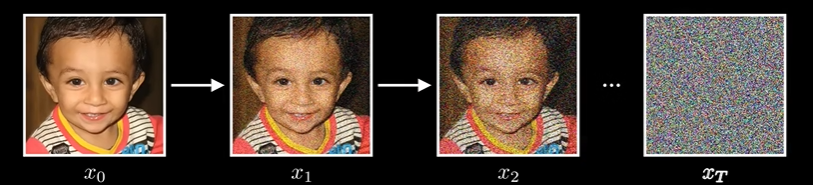

# diffusion model

不存在能够描述图像数据分布的单一表达式。但是即使没有公式，我们仍然希望能够直接生成图像，相当于从其潜在分布中抽取新样本，所以关键挑战就是如何生成新的样本，扩散模型就是来解决这个问题的，用一个看似不相关的过程来解决这个问题：从图像中去除高斯噪声

## steps

首先，我们通过逐步添加高斯噪声来破坏图像，每一步都只添加少量噪声，从而慢慢抹去图像的结构，一步一步知道变成纯粹的噪声

所以关键的思想就是训练一个模型，让它学会缓慢的逆转这些步骤，去除噪声，最终，如果模型有效，它应该可以从随机噪声开始，并且一步步将其细化成有意义的图像
